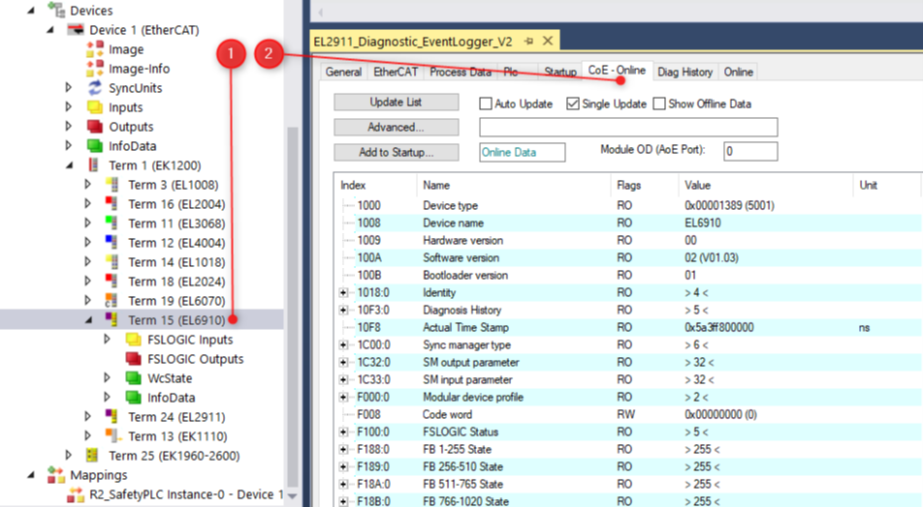

# About This Repository

This sample is created by [Beckhoff Automation LLC.](https://www.beckhoff.com/en-us/), and is provided as-is under the Zero-Clause BSD license.

Attention!

The document below contains an example of the use of the product and a set of recommendations and good practices. It is for training purposes only and requires further modification before being used in a real application. The author of the document bears no responsibility for improper use of the product. This document in no way replaces the technical documentation available online at https://infosys.bekhoff.com.

## Quick step Safety Diagnostic

FB_SafeDiag Beckhoff block configuration instructions

### Contents

[1 Function block description [2](#function-block-description)](#function-block-description)

[1.1 Data downloaded after CoE [2](#data-downloaded-after-coe)](#data-downloaded-after-coe)

[1.2 EventLogger and Diag History data [2](#eventlogger-and-diag-history-data)](#eventlogger-and-diag-history-data)

[1.3 Example of using the SafeDiag block [3](#example-of-using-the-safediag-block)](#example-of-using-the-safediag-block)

[2 Function block configuration [3](#function-block-configuration)](#function-block-configuration)

[2.1 AmsNetId [3](#amsnetid)](#amsnetid)

[2.2 Slave Address [4](#slave-address)](#slave-address)

[2.3 Guide [4](#guid)](#guid)

[2.3.1 Obtaining the module name from I/O [4](#obtaining-the-module-name-from-io)](#obtaining-the-module-name-from-io)

[2.3.2 Obtaining the GUID of the Safety module [5](#obtaining-the-guid-of-the-safety-module)](#obtaining-the-guid-of-the-safety-module)

[3 The structure of the returned data [5](#the-structure-of-the-returned-data)](#the-structure-of-the-returned-data)

### Function block description

The purpose of the SafeDiag function block is to facilitate the diagnosis of the EL6910, EL2911 safety modules and the EK1960 series of modules. The data returned by the block is assigned to a structure of the ST_SafeDiag type.

The operation of the block is based on downloading data from the indicated module using the CoE interface (CAN application protocol over EtherCAT) and reading the errors of the safety module using the DiagHistory function block based on the GUID number.

### Data downloaded after CoE

The data made available via the CoE interface of each module can be viewed in the CoE - Online tab after selecting the module of interest from the I/O tab of the Solution Explorer window. The SafeDiag block automatically downloads predefined data from this interface - more information about the downloaded data will be described in the "Structure of returned data" chapter.

### EventLogger and Diag History data

To retrieve error data, the SafeDiag block internally uses FB_DiagHistory blocks that retrieve data from the TwinCat3 Event Logger interface, which records events. These events are grouped into classes (categories) such as Alarm or Message.

Please remember that for proper operation of the DiagHistory and SafeDiag blocks, the GUID must be provided, as described later in this manual, and the controller must be in RUN mode.

It should also be remembered that events are stored in volatile memory by default - it is the user's responsibility to save the data returned by the function block to non-volatile memory.

Detailed information on operation can be found in the "EventLogger Safety" manual.

### Example of using the SafeDiag block

The screenshot above shows the FB_SafeDiag_Diagnostic block with the connections necessary for operation. The stSafeDiag structure of the ST_SafeDiag type is provided together with the function block and stores data downloaded from the module.

In this case, the bExe variable is a signal initiating the operation of the function block - the block is initiated with an increasing ramp, and after calling, some of the diagnostic data that changes over time is refreshed with a default frequency of 5 seconds.

The method of obtaining AmsNetId, Slave Address and Module_GUID is presented in the next chapter.

Data from the stSafeDiag structure can later be used, for example, to visualize the diagnostic window of the EL2911 safety module.

### Function block configuration

#### AmsNetId

The easiest way to obtain the AmsNetId address of a device is to scan the devices and read it from the I/O-\>Devices tab of the Solution Explorer window after selecting the appropriate EtherCAT device.

#### Slave Address

Slave Address is obtained similarly to AmsNetId, but concerns a specific module (Term).

### GUID

#### Obtaining the module name from I/O

To obtain the module name, expand the I/O branch and copy the module name.

#### Obtaining the GUID of the Safety module

The GUID of the Safety module class is saved in the file C:\TwinCAT\3.1\Boot\CurrentEventMessages.xml when the configuration is activated. To obtain it, open the file in any editor and copy the GUID for the appropriate module, as in the photo below:

Important!

The GUID may be different for modules of the same type, so it must be checked for each module.

### The structure of the returned data

Diagnostic data from the block is returned to the ST_SafeDiag type structure. This structure consists of the following substructures:

Substructures store the following data:

| **Variable Name**                              | **Type**                                 | **Sample Value** | **Description**                                              |
| ---------------------------------------------- | ---------------------------------------- | ---------------- | ------------------------------------------------------------ |
| **ST_SafeDiag_HardwareInfos**                  |                                          |                  |                                                              |
| iVoltageC1                                     | INT                                      | 3285 \[mV\]      | Bus voltage behind the module                                |
| iVoltageC2                                     | INT                                      | 3315 \[mV\]      | Bus voltage before the module                                |
| iTemperatureC1                                 | INT                                      | 47 \[°C\]        | Temp. module on the B side                                   |
| iTemperatureC2                                 | INT                                      | 44 \[°C\]        | Temp. module on side A                                       |
| **ST_SafetyProjectInfos**                      |                                          |                  |                                                              |
| wSafeLogicState                                | WORD                                     | 0                | State of safety logic                                        |
| eSafeLogicState                                | ENUM                                     | OFFLINE          | Enum of the safety logic state                               |
| wCycleCounter                                  | WORD                                     | 26               | Cycle counter                                                |
| uliActualSafetyControlTaskExecution            | ULINT                                    | 0                | Execution times of safety tasks in the form of ULINT         |
| uliMinSafetyControlTaskExecutionTime_Run       | ULINT                                    | 69904000         |                                                              |
| uliMinSafetyControlTaskExecutionTime_NotRun    | ULINT                                    | 151466           |                                                              |
| uliActualSafetyControlTaskExecutionTime_Run    | ULINT                                    | 0                |                                                              |
| uliActualSafetyControlTaskExecutionTime_NotRun | ULINT                                    | 201600           |                                                              |
| stActualSafetyControlTaskExecution             | TIMESTRUCT                               | … \[ms\]         | Time to perform safety tasks in the form of time \[h/min/s/ms\] |
| stMinSafetyControlTaskExecutionTime_Run        | TIMESTRUCT                               | 7 \[ms\]         |                                                              |
| stMinSafetyControlTaskExecutionTime_NotRun     | TIMESTRUCT                               | … \[ms\]         |                                                              |
| stActualSafetyControlTaskExecutionTime_Run     | TIMESTRUCT                               | … \[ms\]         |                                                              |
| stActualSafetyControlTaskExecutionTime_NotRun  | TIMESTRUCT                               | … \[ms\]         |                                                              |
| **ST_SafeDiag_VisualisationInfos**             |                                          |                  |                                                              |
| arrBasicInfos                                  | ARRAY                                    |                  | The array contains data from the BasicInfos structure used in the visualization |
| arrHardwareInfos                               | ARRAY                                    |                  | The array contains data from the HardwareInfos structure used in the visualization |
| arrSafetyInfos                                 | ARRAY                                    |                  | The array contains data from the SafetyProjectInfos structure used in the visualization |
| sModelNumber                                   | STRING                                   | EL2911           | String with the module name                                  |
| **ST_EtherCatSlaveBasicInfos**                 |                                          |                  |                                                              |
| ST_EcSlaveConfigData                           | Substructure: ST_EtherCatSlaveBasicInfos |                  |                                                              |
| nEntries                                       | WORD                                     | 37               | Zmienna wewnętrzna                                           |
| nAddr                                          | WORD                                     | 1008             | Adres urządzenia                                             |
| sType                                          | STRING                                   | EL6910           | Typ modułu                                                   |
| sName                                          | STRING                                   | Term 15 (EL6910) | Term i typ modułu                                            |
| nDevType                                       | DWORD                                    | 0                | EtherCat Device Type                                         |
| ST_EcSlaveIdentity                             | Substructure: ST_EtherCatSlaveBasicInfos |                  |                                                              |
| vendorId                                       | UDINT                                    | 2                | Vendor-ID of the device                                      |
| productCode                                    | UDINT                                    | 452866130        | Device product code                                          |
| revisionNo                                     | UDINT                                    | 1114112          | Device version                                               |
| serialNo                                       | UDINT                                    | 0                | Device serial number                                         |
| nMailboxOutSize                                | WORD                                     | 256              | MailboxIn EtherCat size                                      |
| nMailboxInSize                                 | WORD                                     | 256              | MailboxOut EtherCat size                                     |
| dSafetyLogicSerialNo                           | DWORD                                    |                  | Serial number of the safety device (consistent with that visible on the module and in the configuration window) |

# How to get support

Should you have any questions regarding the provided sample code, please contact your local Beckhoff support team. Contact information can be found on the official Beckhoff website at https://www.beckhoff.com/en-us/support/.

# Further Information

-- UPDATE THIS SECTION -- 
Further Information on -- THIS REPO TOPIC -- can be found at the [Beckhoff Infosys](https://infosys.beckhof.com) under the [REPO TOPIC](https://infosys.beckhoff.com/content/1033/ethercatsystem/2469077771.html?id=8287668039751154112)

## Requirements

The following components must be installed to run sample code:

- [TE1000 TwinCAT 3 Engineering](https://www.beckhoff.com/en-en/products/automation/twincat/te1xxx-twincat-3-engineering/te1000.html) version 3.1.4024.0 or higher
- -- UPDATE THIS SECTION --
